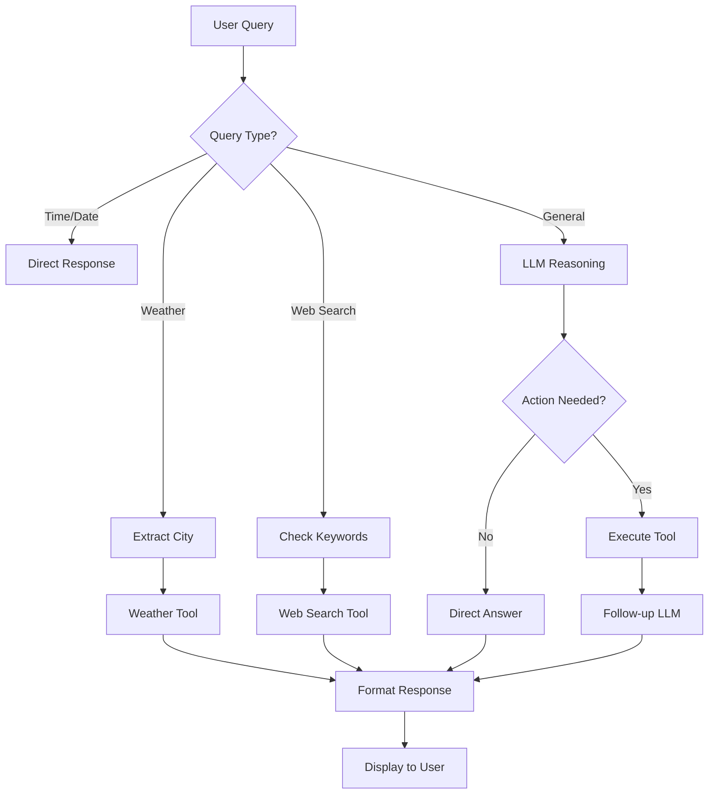

# 🧠 ReAct Agent - Intelligent Conversational Assistant

## 📖 Overview

**ReAct Agent** is an advanced AI-powered conversational assistant that combines **Reasoning** and **Acting** capabilities to provide intelligent responses. Built with **Groq LLM**, it seamlessly integrates real-time tools for web search and weather updates, delivering a sophisticated chat experience through a beautiful Streamlit interface.

### 🎯 What Makes It Special?

- 🧠 **ReAct Framework**: Implements the Reasoning + Acting paradigm for intelligent decision-making
- 🌐 **Multi-Tool Integration**: Automatically selects and uses the right tool for each query
- 🎨 **Modern UI**: Stunning gradient interface with glassmorphism effects
- 🚀 **Real-Time Processing**: Live web search and weather data
- 🔄 **Context-Aware**: Maintains conversation history and context

---

## ✨ Features

### Core Capabilities

| Feature | Description | Icon |
|---------|-------------|------|
| **Intelligent Reasoning** | Powered by Groq's Llama 3.3 70B model for advanced language understanding | 🧠 |
| **Web Search** | Real-time web search with 70+ keyword triggers across 9 categories | 🔍 |
| **Weather Updates** | Current weather data for any city worldwide with smart city detection | 🌤️ |
| **Beautiful UI** | Modern chat interface with gradient backgrounds and smooth animations | 🎨 |
| **Tool Tracking** | Visual badges showing which tools were used for each response | 🛠️ |
| **Conversation History** | Persistent chat history with timestamps | 💬 |
| **Error Handling** | Graceful error recovery with user-friendly messages | ⚠️ |

### Web Search Categories

The agent automatically triggers web search for queries in these categories:
- 📰 News & Updates (breaking, trending, latest)
- 🤖 Technology & AI (artificial intelligence, machine learning)
- 🏛️ Politics & Government (elections, policies)
- 💼 Business & Economy (finance, markets, stocks)
- 🔬 Science & Research (discoveries, studies)
- 🌍 Global & World Events (international news)
- ⚽ Sports & Entertainment (games, movies, celebrities)
- ❓ Question Words (who is, what is, how to)
- 📊 Informational (statistics, data, reports)

---

## 📂 Project Structure

```
react_agent_project/
│
├── agent.py                # 🤖 Main ReAct agent logic with tool routing
├── app.py                  # 🖥️ Streamlit UI (Beautiful chat interface)
├── prompts.py              # 💭 LLM prompts (ReAct & Follow-up templates)
├── tools.py                # 🛠️ Web search & weather tool implementations
├── requirements.txt        # 📦 Python dependencies
├── .env                    # 🔐 Environment variables (API keys)
├── .env.example            # 📝 Example environment file
├── README.md               # 📖 Project documentation
└── react_agent_env/        # 🐍 Virtual environment (git ignored)
```

---

## ⚡ Installation

### Prerequisites

- Python 3.8 or higher
- pip package manager
- Groq API key ([Get one here](https://console.groq.com/))
- OpenWeatherMap API key ([Get one here](https://openweathermap.org/api))

### Step-by-Step Setup

1. **Clone the repository**

```bash
git clone https://github.com/UDAYNMURTHY13/react_agent_project.git
cd react_agent_project
```

2. **Create a virtual environment** (recommended)

```bash
# Windows
python -m venv react_agent_env
react_agent_env\Scripts\activate

# Linux/Mac
python3 -m venv react_agent_env
source react_agent_env/bin/activate
```

3. **Install dependencies**

```bash
pip install -r requirements.txt
```

4. **Set up environment variables**

Create a `.env` file in the project root:

```bash
# .env
GROQ_API_KEY=your_groq_api_key_here
OPENWEATHER_API_KEY=your_openweather_api_key_here
```

> 💡 **Tip**: Copy `.env.example` to `.env` and fill in your API keys


### 🔍 Web Search Queries

```
Latest AI developments
Who is the CEO of Tesla?
Breaking news technology
Stock market trends today
How to learn Python programming
Movie reviews 2024
```

### 🌤️ Weather Queries

```
What's the weather in Paris?
Tokyo weather forecast
Temperature in New York
Is it raining in London?
Weather in Bangalore
```

### 🧠 Reasoning Queries

```
Explain quantum computing
What are the benefits of renewable energy?
How does blockchain work?
What time is it?
What's today's date?
```

---

## 🎨 UI Features

### Modern Design Elements

- **Gradient Background**: Purple-themed gradient with glassmorphism
- **Tool Badges**: Visual indicators for tool usage (🔍 Web Search, 🌤️ Weather)
- **Thinking Animation**: Smooth pulse animation during processing
- **Message Timestamps**: Track conversation timing
- **Statistics Sidebar**: Live message and conversation counters
- **Quick Action Buttons**: Pre-configured query suggestions
- **Responsive Layout**: Optimized for all screen sizes

## 🛠️ Tools & Technologies

### Core Stack

| Technology | Purpose | Version |
|-----------|---------|---------|
| [Python](https://www.python.org/) | Programming Language | 3.8+ |
| [Streamlit](https://streamlit.io/) | Web UI Framework | 1.28+ |
| [LangChain](https://langchain.com/) | LLM Framework | Latest |
| [Groq](https://groq.com/) | LLM Provider (Llama 3.3 70B) | Latest |

### Tools

| Tool | Description | API |
|------|-------------|-----|
| 🌤️ **Weather Tool** | Fetches real-time weather data for any city | OpenWeatherMap API |
| 🔍 **Web Search Tool** | Searches web for articles and information | DuckDuckGo/Tavily API |
| 🧠 **Groq LLM** | Advanced reasoning using ReAct framework | Groq API |

## 🔄 How It Works

### ReAct Framework Flow



### Processing Pipeline

1. **Query Analysis**: Determine query type and intent
2. **Tool Selection**: Choose appropriate tool or reasoning path
3. **Action Execution**: Call selected tool or LLM
4. **Response Generation**: Format and present results
5. **Display**: Show response with tool badges and timestamp

---

## 🌐 Live Demo
Access the deployed application here:
🔗 https://reactagentproject-xqffkmrky3huewzcuxza8o.streamlit.app/

## 🤝 Contributing

Contributions are welcome! Here's how you can help:

1. **Fork the repository**
2. **Create a feature branch** (`git checkout -b feature/amazing-feature`)
3. **Commit your changes** (`git commit -m 'Add amazing feature'`)
4. **Push to the branch** (`git push origin feature/amazing-feature`)
5. **Open a Pull Request**

### Areas for Contribution

- 🔧 Add new tools (Calculator, Database Query, etc.)
- 🌍 Improve city detection for weather
- 🎨 Enhance UI/UX design
- 📝 Improve documentation
- 🐛 Fix bugs and issues
- ⚡ Performance optimizations

---

## 📝 License

This project is licensed under the **MIT License**. See the [LICENSE](LICENSE) file for details.

---

## 🙏 Acknowledgments

- **Groq** for providing fast LLM inference
- **LangChain** for the amazing agent framework
- **Streamlit** for the beautiful UI framework
- **OpenWeatherMap** for weather data
- **DuckDuckGo** for web search capabilities

---

## 👨‍💻 Author

**Uday N Murthy**

- 🌐 GitHub: [@UDAYNMURTHY13](https://github.com/UDAYNMURTHY13)
- 💼 LinkedIn: [Uday N Murthy](https://www.linkedin.com/in/udaynmurthy/)
- 📧 Email: udaynmurthy@example.com

---

## 📊 Project Stats


---

## 🔗 Links

- 📚 [Documentation](https://github.com/UDAYNMURTHY13/react_agent_project/wiki)
- 🐛 [Report Bug](https://github.com/UDAYNMURTHY13/react_agent_project/issues)
- 💡 [Request Feature](https://github.com/UDAYNMURTHY13/react_agent_project/issues)
- 🌟 [Star on GitHub](https://github.com/UDAYNMURTHY13/react_agent_project)

---

<div align="center">

**Made with ❤️ by Uday N Murthy**

**⭐ Star this repo if you find it helpful!**

</div>
